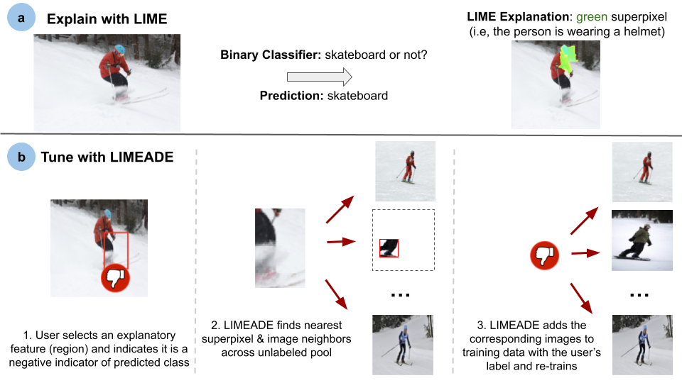

# LIMEADE: From AI Explanations to Advice Taking

This repository contains code related to the image domain experiment in our LIMEADE paper. In this experiment, we to study whether LIMEADE allows humans to update real-world models more effectively than simply labeling more instances. Below, we provide a summary of the experiment and detail the code included in this repository.

## Experiment Summary
In particular, we use LIMEADE to enable updates based on simulated end-user advice for twenty deep neural image classifiers, e.g., a skateboard detector or fire hydrant detector. Below, we illustrate an example of how LIMEADE is used to process high-level advice in this context. 

In our experiment, we evaluate on binary image classifiers, each comprising a logistic regression model trained on pre-computed image embeddings. As a base image dataset, we utilize 20,000 images from the COCO dataset. In order to create superpixel features for LIMEADE feedback, we leverage the same segmentation algorithm used by LIME to compute superpixels for all 20,000 images. To generate embeddings for all full images and corresponding individual superpixels, we retrieve their representations from the penultimate layer of a ResNet-50 backbone pre-trained on ImageNet. For a given superpixel, we compute the corresponding embedding by feeding the mimimum bounding box containing the superpixel to the embedding model. For each image, we compute an embedding for each individual superpixel, as well as the full image. Pre-computing these embeddings results in a bank of embeddings for 20,000 images along with embeddings for all corresponding individual superpixels.

In order to ensure that our embeddings had not already been trained on the target classes in our experiment, we test binary classifiers only on all 20 classes that are in COCO but not in ImageNet-1000 (the 20 classes are: baseball glove, snowboard, giraffe, carrot, surfboard, fork, sink, cow, donut, toothbrush, knife, bed, horse, cake, motorcycle, frisbee, skateboard, fire hydrant, scissors, and suitcase). We want to measure the performance of a LIMEADE update relative to a baseline update, so we complete 100 randomized initial configurations for each class. Moreover, for each configuration, we randomly construct an initial training set of one positive and one negative instance. We evaluate the two-shot accuracy of a logistic regression model on a held-out validation set and then perform one of the following two updates with both a randomly-drawn positive instance and a randomly-drawn negative instance simultaneously to preserve class balance:
- **Baseline**: We update the model by adding the positive and negative instances to the training data and retraining.
- **LIMEADE**: First, we generate LIME explanations of the opaque classifier for both the positive and negative instance. In the positive case, we simulate a human's advice in response to the explanation by utilizing the COCO segmentation masks to automatedly give the superpixel(s) indicative of the class a positive label (i.e., in the case of "giraffe," we select all superpixels containing giraffes using the COCO segmentation masks in the image labeled as "giraffe"). In the negative case, we give the superpixel most influencing the LIME explanation a negative label. We then generate embeddings of these labeled regions and use the embeddings to retrieve the nearest superpixels and full images across the unused pool (consisting of 19,996 images, along with their individual superpixels). We append the embeddings of the nearest neighbors' corresponding full images to the training data along with + and - labels, respectively, and retrain.This simulated approach to human advice enables us to study the effectiveness of LIMEADE updates by testing many initial configurations across a range of image classes.

We evaluate LIMEADE across different hyperparameter settings. In particular, we vary the number of nearest neighbors included in the update ({1, 5, 10, 25, 50, 100}), as well as the relative sample weight of the update ({0.25, 0.5, 1, 2, 4}), and perform a grid search. We evaluated performance on a balanced, held-out validation set of 400 positive instances and 400 negative instances for each class and select the hyperparameters with the highest validation accuracy. We find that this process yields a relative sample weight of 0.25, as well as 50 nearest neighbors included in the update. With these hyperparameters selected, we then evaluate final performance on a separate, held-out test set of 400 positive instances and 400 negative instances for each class.

## Experiment Results
 We find that LIMEADE updates with simulated advice outperform the baseline for 16 of 20 classes, giving an average boost of 9.33% compared to the baseline's average boost of 8.21%. These results are statistically significant: a paired t-test of \sys\ against the baseline yields a p-value of 2.3 x 10-9 across all 2,000 runs. A full table of results can be found in our paper.

## Code
Our code utilizes the <a href="https://cocodataset.org/#home">COCO dataset</a>, <a href="https://arxiv.org/abs/1512.03385">ResNet</a> embeddings, and <a href="https://dl.acm.org/doi/10.1145/2939672.2939778">LIME</a>. Below, we describe the files included in this repository.

### Preprocessing Code (preprocessing.ipynb)
This notebook contains the pre-processing code necessary to set up our experiments. Once the COCO dataset has been downloaded, this code performs the following steps:
1. For each image, the same image segmentation algorithm used by LIME is utilized to generate superpixels.
2. A ResNet embedding is generated for each superpixel by computing the minimum bounding box around the superpixel, cropping out the image region within the bounding box, and sending feeding this region to the embedding model. A ResNet embedding is also generated for each full image.
This code is parallelized; to be properly executed, the code should be converted from a notebook to a simple Python script for execution. Be sure to replace the COCO dataset paths in the code appropriately.

### Experiment Code (experiment.ipynb)
This notebook contains the main code for the image domain experiment, as summarized above and detailed in our paper. To run this code, the COCO dataset must have been downloaded already, and preprocessing.ipynb must have been run as well. For this code to run, be sure that the the paths to the COCO data, as well as the computed embeddings, are all correct. In order to analyze the results of the experiment, the output JSON files for each iteration must be compiled and analyzed. Note that the baseline score on the test data is given by `new_test_score_added_instance`, whereas the LIMEADE scores on the test data are given by `new_test_scores_neighbors` (an array that contains the results across all `n_neighbor` and `neighbors_weight` configurations.)

### Questions
If you have any questions about this code, feel free to email Benjamin Lee at [bcgl@cs.washington.edu](mailto:bcgl@cs.washington.edu).
